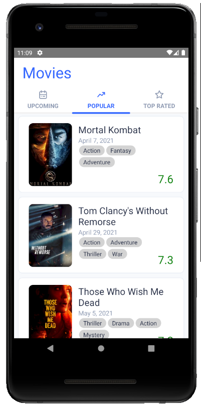

# LesmoMovies

<center>
  
</center>

This is a _quickie_ displaying a bit of React Native magic. This basic implementation allows you
to explore [The Movie Database](https://www.themoviedb.org/) using its API.


## Running

Grab a build from the Releases or, well... it's React Native, so:

```console
$ npm run android
$ npm run ios
```

## Hightlights

* Integrated CI with [Github Actions](https://github.com/features/actions):
  * Run Unit Tests
  * Build an Android Release
* [UI Kitten](https://github.com/akveo/react-native-ui-kitten), my favorite UI framework
* [Typescript](https://github.com/Microsoft/TypeScript) because I ♥ type safety
* [Axios](https://github.com/axios/axios) and [`axios-cache-adapter`](https://github.com/RasCarlito/axios-cache-adapter)
  for quickly building a wrapper to interact with TMDB and provide type safety and handling of some "complex" image URL
  generation, etc.
* [React Navigation 5](https://github.com/react-navigation/react-navigation) for, well... navigating between screens
* Infinite scrolling, implemented with React Native's FlatList to provide better performance.

## Possible Improvements

* **Dark mode:** out of the box, UI Kitten is ready to handle the runtime change of the theme. It's already built, so we only
  need to add a simple "listener" of what theme is the user currently using (light or dark).
* **i18n:** it's amazing that TMDB supports multiple locales, so we can easily integrate localization with a bit of work.
* **Better design:** TMDB's API provides access to the movies' logo and backdrop as separate images, which would allow us
  to build an much nicer UI.
